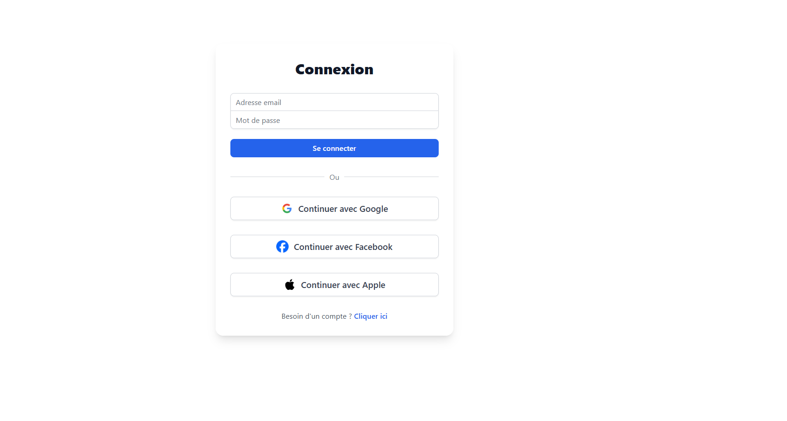
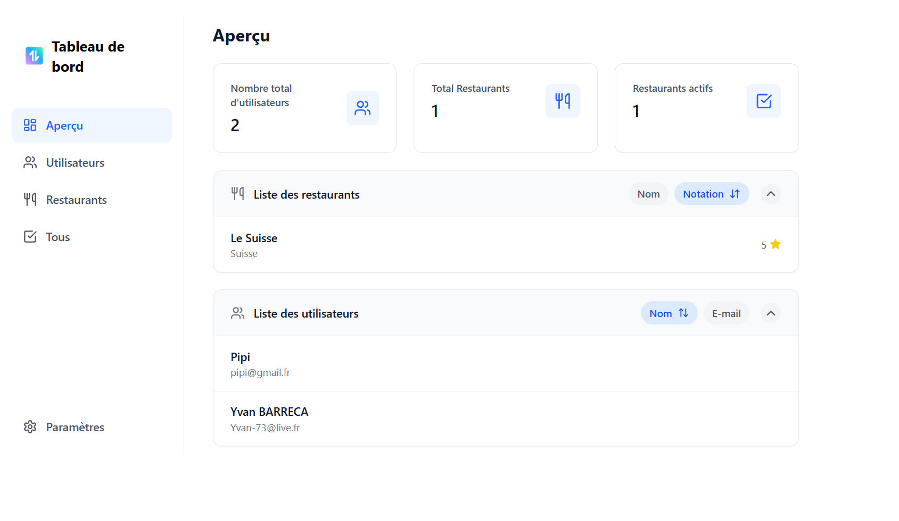
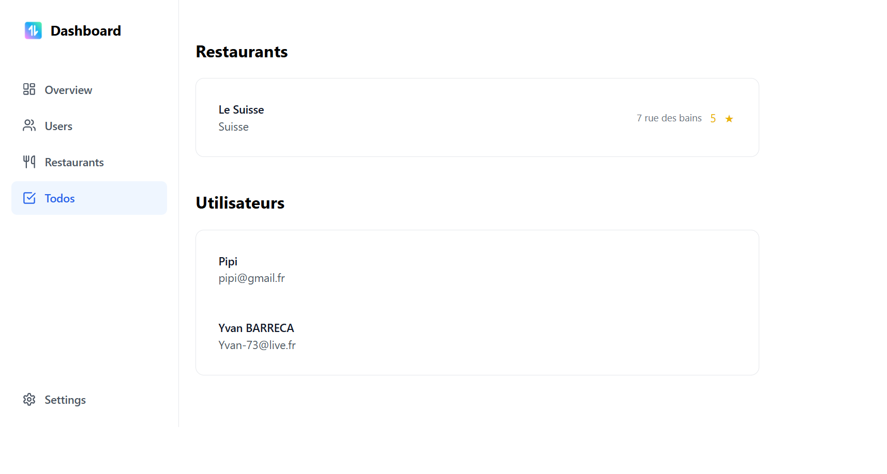

<div align="center"> <h2>🚀 vite-react-typescript-starter – Template API avec React + Vite + TypeScript</h2>  </div>

## 🌍 Description
Ce projet est un template moderne pour le développement d'applications web avec une API intégrée ou connectée à un backend externe.

## Fonctionnalités clés :

⚡ Vite pour le développement rapide

⚛️ React + TypeScript pour le frontend

🔌 Axios pour consommer des APIs

☁️ Supabase intégré pour des services backend

## 🧰 Technologies utilisées
   

## 📦 Installation

1. **Cloner le repo :**
```bash
git clone https://github.com/TonPseudo/api-template.git
cd api-template
```

2. **Installer les dépendances :**
```bash
npm install
```

3. **Lancer l’application :**
```bash
npm run dev
```

🖼️ Aperçu de l'application
    

## 📁 Structure du projet
/src/ → Code source (components, hooks, API...)

/public/ → Fichiers statiques

vite.config.js → Config Vite

package.json → Dépendances et scripts

## ✅ TODO
Ajouter un backend Node/Express ou Supabase RPC

Ajouter l'authentification (JWT, OAuth...)

Déployer (Vercel, Netlify, etc.)

## 🙌 Remerciements

Merci d’avoir jeté un œil à ce projet !  
Il a été pensé pour apprendre, tester, expérimenter — que tu sois développeur junior, formateur ou simplement curieux du **fullstack JS**.

<div align="center">
⭐ N’hésite pas à forker, améliorer ou t’en inspirer ! ⭐  
Bon code à toi 🚀

⭐ Un petit like sur le repo fait toujours plaisir ! ⭐  
</div>

